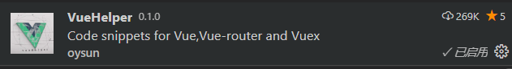
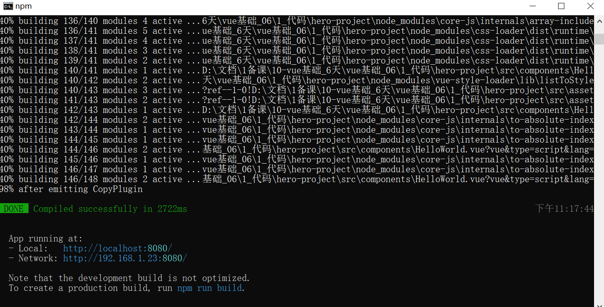
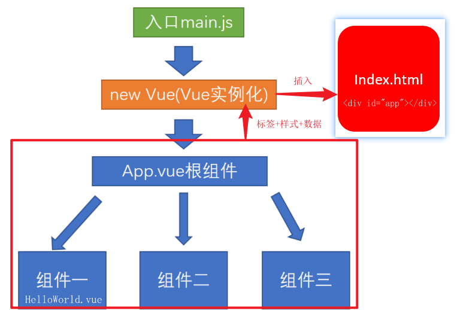
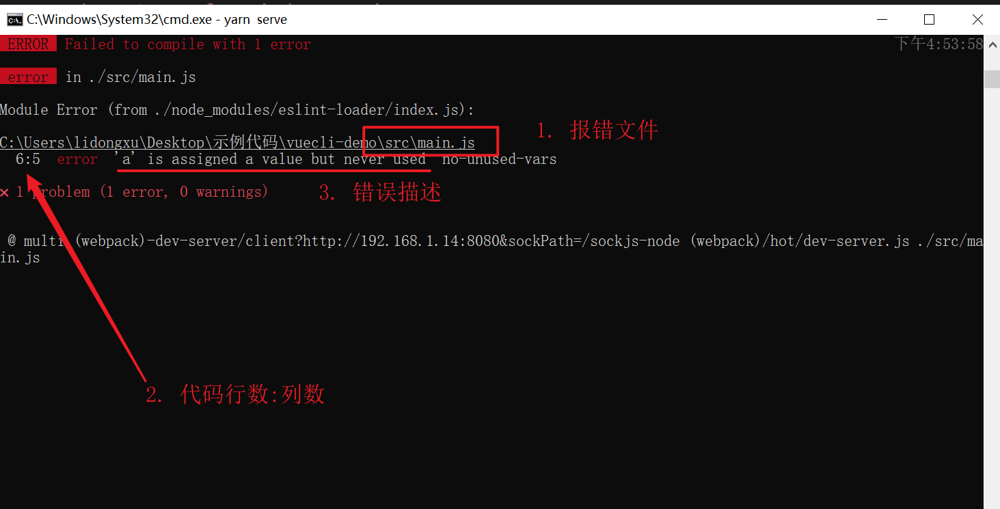
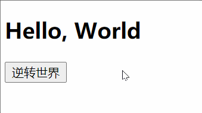
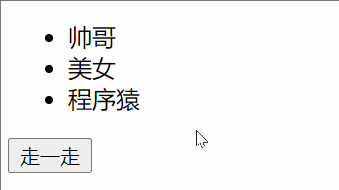

# Day02

## 铺垫(自学)

==需要学员预习时自己提前安装好==

### 可选安装 - 谷歌访问助手

这是一个谷歌浏览器上的插件

安装

1. 必安插件(文件夹)下的 ==google-access-helper-2.3.0(文件夹)==  复制到你想放的文件夹下(==安装后不可以挪动位置==)

> 建议D盘下, 弄一个专门按软件的文件夹

2. 打开谷歌浏览器-扩展程序-开发者模式打开-把文件夹拖进来就安装完毕

   

功能如下:

谷歌浏览器上

* 同步书签(需要注册和登录, 开启同步功能) - 可以暂不使用(因为有的手机号可能注册不了谷歌账号)
* 谷歌商店(无需登录, 安装其他插件)

### 必安装 - vue-devtools

学习, 调试vue必备之利器 - 官方提供的呦

右上角-插件-谷歌访问助手-打开Chrome商店-搜索vue-devtools回车-然后添加至Chrome等待下载后自动安装-右上角显示已经添加即代表成功

如果实在打不开谷歌商店, 换个网 / 直接用备用文件夹里的vue-devtools插件包安装到浏览器扩展程序也一样用

==不要图标上带橘黄色beta的==

==如果这个网址打不开, 就用预习资料里备用的本地版安装也可以, 安装过程和上个插件安装过程一致==


### vscode-插件补充

vue文件代码高亮插件-vscode中安装


代码提示插件-vscode中安装



## 知识点自测

想学会今天的内容, 先测测这几个会不会

- [ ] 表达式, 变量是什么
- [ ] new的作用和含义
- [ ] 实例化对象
- [ ] 什么是对象上的, 属性和方法
- [ ] 对象的赋值和取值
- [ ] this的指向
- [ ] npm/yarn是什么, package.json干什么的, 下载包的命令是什么, 什么是模块化开发
- [ ] 函数的形参实参, 得马上反应过来, 哪个是变量哪个是值, 谁传给谁了

如果通不过, 请记住口诀:

1. 变量是一个容器, 表达式原地都有返回结果

   ```js
   var a = 10;
   console.log(a); // a就是变量, 运行后使用变量里的值再原地打印
   console.log(10 + 50); // 10 + 50 就是表达式
   console.log(a > 9); // 这叫判断表达式, 原地结果是true
   ```

2. new 类名() - 原地得到一个实例对象 - 对象身上有key(或叫属性, 叫键都行), 对应的值是我们要使用的

3. 实例化对象就是new 类名() 创造出来的对象, 身上包含属性(key, 键) 对应的 值

4. 什么是属性和方法(固定格式)

   ```js
   let obj = { // 属性指的是a, b, c, d, e这些名字
       a: 10,
       b: [1, 2, 3],
       c: function(){},
       d () {},
       e: () => {} // 值是冒号:右边的值
   }
   // 这个格式是固定的, 必须张口就来, 张手就写, 准确率100%
   ```

5. 对象的复制和取值(固定格式)

   有=(赋值运算符) 就是赋值, 没有就是取值

   ```js
   let obj = {
       a: 10,
       b: 20
   }
   console.log(obj.a); // 从obj对象的a上取值, 原地打印10
   obj.b = 100; // 有=, 固定把右侧的值赋予给左侧的键, 再打印obj这个对象, b的值是100了
   ```

6. this指向口诀

   在function函数中, this默认指向当前函数的调用者  调用者.函数名()

   在箭头函数中, this指向外层"函数"作用域this的值

## 今日学习目标

1. 能够理解vue的概念和作用
2. 能够理解vuecli脚手架工程化开发
4. 能够使用vue指令

## 1. Vue基本概念

### 1.0_为何学Vue

> 目标: 更少的时间,干更多的活. 开发网站速度, 快


例如: 把数组数据-循环铺设到li中, 看看分别如何做的?

原生js做法

```vue
<ul id="myUl"></ul>
<script>
    let arr = ["春天", "夏天", "秋天", "冬天"];
    let myUl = document.getElementById("myUl");
    for (let i = 0; i < arr.length; i++) {
        let theLi = document.createElement("li");
        theLi.innerHTML = arr[i];
        myUl.appendChild(theLi);
    }
</script>
```

Vue.js做法

```vue
<li v-for="item in arr">{{item}}</li>
<script>
    new Vue({
        // ...
        data: {
            arr: ["春天", "夏天", "秋天", "冬天"] 
        }
    })
</script>
```

注意: 虽然vue写起来很爽, 但是一定不要忘记, vue的底层还是原生js

开发更加的效率和简洁, 易于维护, 快!快!快!就是块 (甚至测试, Java, Python工程师都要学点vue, 方便与前端沟通)

现在很多项目都是用vue开发的


市场上90%工作都要求会vue, 会vue拿高薪, 甚至java或测试都要学点vue


### 1.1_Vue是什么

logo镇楼


==渐进式==javacript==框架==, 一套拥有自己规则的语法

官网地址: https://cn.vuejs.org/ (作者: 尤雨溪)

> ### 什么是渐进式

渐进式: 逐渐进步, 想用什么就用什么, 不必全都使用


Vue渐进式: Vue从基础开始, 会循序渐进向前学习, 如下知识点可能你现在不明白, 但是学完整个vue回过头来看, 会很有帮助


> ### 什么是库和框架

补充概念:

库:  封装的属性或方法 (例jquery.js)

框架: 拥有自己的规则和元素, 比库强大的多 (例vue.js)


### 1.2_Vue学习的方式

+ 传统开发模式：基于html/css/js文件开发vue

  

+ 工程化开发方式：在webpack环境中开发vue，这是最推荐, 企业常用的方式

  


> ### Vue如何学

1. 每天的知识点自测最好做到了如指掌 - 做不到只能花30分钟去记住结论和公式
2. 记住vue指令作用, 基础语法 - 弄一个字典(一一映射关系)
3. 在课上例子, 练习, 案例, 作业, 项目中, 反复磨炼使用
4. 学会查找问题的方式和解决方式(弄个报错总结.md, 避免反复进坑)

> 总结: vue是渐进式框架, 有自己的规则, 我们要记住语法, 特点和作用, 反复磨炼使用, 多总结

## 2. @vue/cli脚手架

### 2.0_@vue/cli 脚手架介绍

> 目标: webpack自己配置环境很麻烦, 下载@vue/cli包,用vue命令创建脚手架项目

- @vue/cli是Vue官方提供的一个全局模块包(得到vue命令), 此包用于创建脚手架项目

  脚手架是为了保证各施工过程顺利进行而搭设的工作平台


> ### @vue/cli的好处

- 开箱即用

  0配置webpack

  babel支持

  css, less支持

  开发服务器支持

### 2.1_@vue/cli安装

> 目标: 把@vue/cli模块包按到全局, 电脑拥有vue命令, 才能创建脚手架工程

+ 全局安装命令

```bash
yarn global add @vue/cli
# OR
npm install -g @vue/cli
```

注意: 如果半天没动静(95%都是网速问题), 可以ctrl c 
1. 停止重新来

2. 换一个网继续重来

+ 查看`vue`脚手架版本

```bash
vue -V
```

> 总结: 如果出现版本号就安装成功, 否则失败

### 2.2_@vue/cli 创建项目启动服务

> 目标: 使用vue命令, 创建脚手架项目

==注意: 项目名不能带大写字母, 中文和特殊符号==

1. 创建项目

```bash
# vue和create是命令, vuecli-demo是文件夹名
vue create vuecli-demo
```

2. 选择模板

   ==可以上下箭头选择, 弄错了ctrl+c重来==


​	 	选择用什么方式下载脚手架项目需要的依赖包

3. 回车等待生成项目文件夹+文件+下载必须的第三方包们


4. 进入脚手架项目下, 启动内置的热更新本地服务器

```bash
cd vuecil-demo

npm run serve
# 或
yarn serve
```

只要看到绿色的 - 啊. 你成功了(底层node+webpack热更新服务)



打开浏览器输入上述地址


> 总结: vue命令创建工程目录, 项目内置webpack本地热更新服务器, 帮我们打包项目预览项目

### 2.3 @vue/cli 目录和代码分析

> 目标: 讲解重点文件夹, 文件的作用, 以及文件里代码的意思

```bash
 vuecil-demo        # 项目目录
    ├── node_modules # 项目依赖的第三方包
    ├── public       # 静态文件目录
      ├── favicon.ico# 浏览器小图标
      └── Index.html # 单页面的html文件(网页浏览的是它)
    ├── src          # 业务文件夹
      ├── assets     # 静态资源
        └── logo.png # vue的logo图片
      ├── components # 组件目录
        └── HelloWorld.vue # 欢迎页面vue代码文件 
      ├── App.vue    # 整个应用的根组件
      └── main.js    # 入口js文件
    ├── .gitignore   # git提交忽略配置
    ├── babel.config.js  # babel配置
    ├── package.json  # 依赖包列表
    ├── README.md    # 项目说明
	└── yarn.lock    # 项目包版本锁定和缓存地址
```

主要文件及含义

```js
node_modules下都是下载的第三方包
public/index.html – 浏览器运行的网页
src/main.js – webpack打包的入口文件
src/App.vue – vue项目入口页面
package.json – 依赖包列表文件
```

### 2.4_@vue/cli 项目架构了解

> 目标: 知道项目入口, 以及代码执行顺序和引入关系



### 2.5_@vue/cli 自定义配置

> 目标：项目中没有webpack.config.js文件，因为@vue/cli用的vue.config.js

src并列处新建vue.config.js

```jsx
/* 覆盖webpack的配置 */
module.exports = {
  devServer: { // 自定义服务配置
    open: true, // 自动打开浏览器
    port: 3000
  }
}
```

### 2.6_eslint了解

> 目标: 知道eslint的作用, 和如何暂时关闭, 它是一个==代码检查工具==

例子: 先在main.js 随便声明个变量, 但是不要使用


观察发现, 终端和页面都报错了

==记住以后见到这样子的错误, 证明你的代码不严谨==




方式1: 手动解决掉错误, 以后项目中会讲如何自动解决

方式2: 暂时关闭eslint检查(因为现在主要精力在学习Vue语法上), 在vue.config.js中配置后重启服务


### 2.7_@vue/cli 单vue文件讲解

> 目标: 单vue文件好处, 独立作用域互不影响

Vue推荐采用.vue文件来开发项目

template里只能有一个根标签

vue文件-独立模块-作用域互不影响

style配合scoped属性, 保证样式只针对当前template内标签生效

vue文件配合webpack, 把他们打包起来插入到index.html

```vue
<!-- template必须, 只能有一个根标签, 影响渲染到页面的标签结构 -->
<template>
  <div>欢迎使用vue</div>
</template>

<!-- js相关 -->
<script>
export default {
  name: 'App'
}
</script>

<!-- 当前组件的样式, 设置scoped, 可以保证样式只对当前页面有效 -->
<style scoped>
</style>

```

最终: Vue文件配合webpack, 把他们打包起来插入到index.html, 然后在浏览器运行

### 2.8_@vue/cli 欢迎界面清理

> 目标: 我们开始写我们自己的代码, 无需欢迎页面

* src/App.vue默认有很多内容, 可以全部删除留下框
* assets 和 components 文件夹下的一切都删除掉 (不要默认的欢迎页面)

## ==3. Vue指令==

### 3.0_vue基础-插值表达式

> 目的: 在dom标签中, 直接插入内容

又叫: 声明式渲染/文本插值

语法: {{ 表达式 }}

```jsx
<template>
  <div>
    <h1>{{ msg }}</h1>
    <h2>{{ obj.name }}</h2>
    <h3>{{ obj.age > 18 ? '成年' : '未成年' }}</h3>
  </div>
</template>

<script>
export default {
  data() { // 格式固定, 定义vue数据之处
    return {  // key相当于变量名
      msg: "hello, vue",
      obj: {
        name: "小vue",
        age: 5
      }
    }
  }
}
</script>

<style>
</style>

```

> 总结: dom中插值表达式赋值, vue的变量必须在data里声明

### 3.1_vue基础-MVVM设计模式

> 目的: 转变思维, 用数据驱动视图改变, 操作dom的事, vue源码内干了

设计模式: 是一套被反复使用的、多数人知晓的、经过分类编目的、代码设计经验的总结。

演示: 在上个代码基础上, 在devtool工具改变M层的变量, 观察V层(视图的自动同步)

等下面学了v-model再观察V改变M的效果


+ MVVM，一种软件架构模式，决定了写代码的思想和层次
  + M：   model数据模型          (data里定义)	
  + V：    view视图                   （html页面）
  + VM： ViewModel视图模型  (vue.js源码)

- MVVM通过`数据双向绑定`让数据自动地双向同步  **不再需要操作DOM**
  - V（修改视图） -> M（数据自动同步）
  - M（修改数据） -> V（视图自动同步）


**1. 在vue中，不推荐直接手动操作DOM！！！**  

**2. 在vue中，通过数据驱动视图，不要在想着怎么操作DOM，而是想着如何操作数据！！**(思想转变)


> 总结: vue源码内采用MVVM设计模式思想, 大大减少了DOM操作, 挺高开发效率

### 3.2_vue指令-v-bind

> 目标: 给标签属性设置vue变量的值

**vue指令, 实质上就是特殊的 html 标签属性, 特点:  v- 开头**

每个指令, 都有独立的作用

- 语法：`v-bind:属性名="vue变量"`
- 简写：`:属性名="vue变量"`

```html
<!-- vue指令-v-bind属性动态赋值 -->
<a v-bind:href="url">我是a标签</a>

```

> 总结: 把vue变量的值, 赋予给dom属性上, 影响标签显示效果

### 3.3_vue指令-v-on

> 目标: 给标签绑定事件

* 语法
  * v-on:事件名="要执行的==少量代码=="
  * v-on:事件名="methods中的函数"
  * v-on:事件名="methods中的函数(实参)" 
* 简写: @事件名="methods中的函数"

```html
<!-- vue指令:   v-on事件绑定-->
<p>你要买商品的数量: {{count}}</p>
<button v-on:click="count = count + 1">增加1</button>
<button v-on:click="addFn">增加1个</button>
<button v-on:click="addCountFn(5)">一次加5件</button>

<button @click="subFn">减少</button>

<script>
    export default {
        // ...其他省略
        methods: {
            addFn(){ // this代表export default后面的组件对象(下属有data里return出来的属性)
                this.count++
            },
            addCountFn(num){
                this.count += num
            },
            subFn(){
                this.count--
            }
        }
    }
</script>
```

> 总结: 常用@事件名, 给dom标签绑定事件, 以及=右侧事件处理函数

### 3.4_vue指令-v-on事件对象

> 目标: vue事件处理函数中, 拿到事件对象

* 语法:
  * 无传参, 通过形参直接接收
  * 传参, 通过$event指代事件对象传给事件处理函数

```vue
<template>
  <div>
    <a @click="one" href="http://www.baidu.com">阻止百度</a>
    <hr>
    <a @click="two(10, $event)" href="http://www.baidu.com">阻止去百度</a>
  </div>
</template>

<script>
export default {
  methods: {
    one(e){
      e.preventDefault()
    },
    two(num, e){
      e.preventDefault()
    }
  }
}
</script>
```

### 3.5_vue指令-v-on修饰符

> 目的: 在事件后面.修饰符名 - 给事件带来更强大的功能

* 语法:
  * @事件名.修饰符="methods里函数"
    * .stop - 阻止事件冒泡
    * .prevent - 阻止默认行为
    * .once - 程序运行期间, 只触发一次事件处理函数

```html
<template>
  <div @click="fatherFn">
    <!-- vue对事件进行了修饰符设置, 在事件后面.修饰符名即可使用更多的功能 -->
    <button @click.stop="btn">.stop阻止事件冒泡</button>
    <a href="http://www.baidu.com" @click.prevent="btn">.prevent阻止默认行为</a>
    <button @click.once="btn">.once程序运行期间, 只触发一次事件处理函数</button>
  </div>
</template>

<script>
export default {
  methods: {
    fatherFn(){
      console.log("father被触发");
    },
    btn(){
      console.log(1);
    }
  }
}
</script>
```

> 总结: 修饰符给事件扩展额外功能

### 3.6_vue指令-v-on按键修饰符

> 目标: 给键盘事件, 添加修饰符, 增强能力

* 语法:
  * @keyup.enter  -  监测回车按键
  * @keyup.esc     -   监测返回按键

[更多修饰符](https://cn.vuejs.org/v2/guide/events.html#%E6%8C%89%E9%94%AE%E4%BF%AE%E9%A5%B0%E7%AC%A6) 

```html
<template>
  <div>
    <input type="text" @keydown.enter="enterFn">
    <hr>
    <input type="text" @keydown.esc="escFn">
  </div>
</template>

<script>
export default {
 methods: {
   enterFn(){
     console.log("enter回车按键了");
   },
   escFn(){
     console.log("esc按键了");
   }
 }
}
</script>
```

> 总结: 多使用事件修饰符, 可以提高开发效率, 少去自己判断过程

### 3.7_课上练习-翻转世界

> 目标: 点击按钮 - 把文字取反显示 - 再点击取反显示(回来了)

> 提示: 把字符串取反赋予回去

效果演示:



正确代码:

```html
<template>
  <div>
    <h1>{{ message }}</h1>
    <button @click="btn">逆转世界</button>
  </div>
</template>

<script>
export default {
  data() {
    return {
      message: "HELLO, WORLD",
    };
  },
  methods: {
    btn(){
      this.message = this.message.split("").reverse().join("")
    }
  }
};
</script>
```

> 总结: 记住方法特点, 多做需求, vue是数据变化视图自动更新, 减少操作DOM时间, 提高开发效率

### 3.8_vue指令 v-model

> 目标: 把value属性和vue数据变量, 双向绑定到一起

* 语法: v-model="vue数据变量"
* 双向数据绑定
  * 数据变化 -> 视图自动同步
  * 视图变化 -> 数据自动同步
* 演示: 用户名绑定 - vue内部是MVVM设计模式

```vue
<template>
  <div>
    <!-- 
    	v-model:是实现vuejs变量和表单标签value属性, 双向绑定的指令
    -->
    <div>
      <span>用户名:</span>
      <input type="text" v-model="username" />
    </div>
    <div>
      <span>密码:</span>
      <input type="password" v-model="pass" />
    </div>
    <div>
      <span>来自于: </span>
      <!-- 下拉菜单要绑定在select上 -->
      <select v-model="from">
        <option value="北京市">北京</option>
        <option value="南京市">南京</option>
        <option value="天津市">天津</option>
      </select>
    </div>
    <div>
      <!-- (重要)
      遇到复选框, v-model的变量值
      非数组 - 关联的是复选框的checked属性
      数组   - 关联的是复选框的value属性
       -->
      <span>爱好: </span>
      <input type="checkbox" v-model="hobby" value="抽烟">抽烟
      <input type="checkbox" v-model="hobby" value="喝酒">喝酒
      <input type="checkbox" v-model="hobby" value="写代码">写代码
    </div>
    <div>
      <span>性别: </span>
      <input type="radio" value="男" name="sex" v-model="gender">男
      <input type="radio" value="女" name="sex" v-model="gender">女
    </div>
    <div>
      <span>自我介绍</span>
      <textarea v-model="intro"></textarea>
    </div>
  </div>
</template>

<script>
export default {
  data() {
    return {
      username: "",
      pass: "",
      from: "",
      hobby: [], 
      sex: "",
      intro: "",
    };
    // 总结:
    // 特别注意: v-model, 在input[checkbox]的多选框状态
    // 变量为非数组, 则绑定的是checked的属性(true/false) - 常用于: 单个绑定使用
    // 变量为数组, 则绑定的是他们的value属性里的值 - 常用于: 收集勾选了哪些值
  }
};
</script>
```

> 总结: 本阶段v-model只能用在表单元素上, 以后学组件后讲v-model高级用法

### 3.9_vue指令 v-model修饰符

> 目标: 让v-model拥有更强大的功能

* 语法:
  * v-model.修饰符="vue数据变量"
    * .number   以parseFloat转成数字类型
    * .trim          去除首尾空白字符
    * .lazy           在change时触发而非inupt时

```vue
<template>
  <div>
    <div>
      <span>年龄:</span>
      <input type="text" v-model.number="age">
    </div>
    <div>
      <span>人生格言:</span>
      <input type="text" v-model.trim="motto">
    </div>
    <div>
      <span>自我介绍:</span>
      <textarea v-model.lazy="intro"></textarea>
    </div>
  </div>
</template>

<script>
export default {
  data() {
    return {
      age: "",
      motto: "",
      intro: ""
    }
  }
}
</script>
```

> 总结: v-model修饰符, 可以对值进行预处理, 非常高效好用

### 3.10_vue指令 v-text和v-html

> 目的: 更新DOM对象的innerText/innerHTML

* 语法:
  * v-text="vue数据变量"    
  * v-html="vue数据变量"
* 注意: 会覆盖插值表达式

```vue
<template>
  <div>
    <p v-text="str"></p>
    <p v-html="str"></p>
  </div>
</template>

<script>
export default {
  data() {
    return {
      str: "<span>我是一个span标签</span>"
    }
  }
}
</script>
```

> 总结: v-text把值当成普通字符串显示, v-html把值当做html解析

### 3.11_vue指令 v-show和v-if

> 目标: 控制标签的隐藏或出现

* 语法:
  * v-show="vue变量"            
  * v-if="vue变量" 
* 原理
  * v-show 用的display:none隐藏   (频繁切换使用)
  * v-if  直接从DOM树上移除
* 高级
  * v-else使用

```html
<template>
  <div>
    <h1 v-show="isOk">v-show的盒子</h1>
    <h1 v-if="isOk">v-if的盒子</h1>

    <div>
      <p v-if="age > 18">我成年了</p>
      <p v-else>还得多吃饭</p>
    </div>
  </div>
</template>

<script>
export default {
  data() {
    return {
      isOk: true,
      age: 15
    }
  }
}
</script>
```

> 总结: 使用v-show和v-if以及v-else指令, 方便通过变量控制一套标签出现/隐藏

### 3.12_案例-折叠面板

> 目标: 点击展开或收起时，把内容区域显示或者隐藏


此案例使用了less语法, 项目中下载模块

```bash
yarn add less@3.0.4 less-loader@5.0.0 -D
```

只有标签和样式

```vue
<template>
  <div id="app">
    <h3>案例：折叠面板</h3>
    <div>
      <div class="title">
        <h4>芙蓉楼送辛渐</h4>
        <span class="btn" >
          收起
        </span>
      </div>
      <div class="container">
        <p>寒雨连江夜入吴,</p>
        <p>平明送客楚山孤。</p>
        <p>洛阳亲友如相问，</p>
        <p>一片冰心在玉壶。</p>
      </div>
    </div>
  </div>
</template>

<script>
export default {
  data() {
    return {
      
    }
  }
}
</script>

<style lang="less">
body {
  background-color: #ccc;
  #app {
    width: 400px;
    margin: 20px auto;
    background-color: #fff;
    border: 4px solid blueviolet;
    border-radius: 1em;
    box-shadow: 3px 3px 3px rgba(0, 0, 0, 0.5);
    padding: 1em 2em 2em;
    h3 {
      text-align: center;
    }
    .title {
      display: flex;
      justify-content: space-between;
      align-items: center;
      border: 1px solid #ccc;
      padding: 0 1em;
    }
    .title h4 {
      line-height: 2;
      margin: 0;
    }
    .container {
      border: 1px solid #ccc;
      padding: 0 1em;
    }
    .btn {
      /* 鼠标改成手的形状 */
      cursor: pointer;
    }
  }
}
</style>
```

正确答案:

```vue
<template>
  <div id="app">
    <h3>案例：折叠面板</h3>
    <div>
      <div class="title">
        <h4>芙蓉楼送辛渐</h4>
        <span class="btn" @click="isShow = !isShow">
          {{ isShow ? '收起' : '展开' }}
        </span>
      </div>
      <div class="container" v-show="isShow">
        <p>寒雨连江夜入吴, </p>
        <p>平明送客楚山孤。</p>
        <p>洛阳亲友如相问，</p>
        <p>一片冰心在玉壶。</p>
      </div>
    </div>
  </div>
</template>

<script>
export default {
  data() {
    return {
      isShow: false
    }
  }
}
</script>

```

### 3.13_vue指令-v-for

> 目标: 列表渲染, 所在标签结构, 按照数据数量, 循环生成

* 语法
  * v-for="(值, 索引) in 目标结构"
  * v-for="值 in 目标结构"
  
* 目标结构:
  
  * 可以遍历数组 / 对象 / 数字 / 字符串 (可遍历结构)
  
* 注意:

  v-for的临时变量名不能用到v-for范围外

```vue
<template>
  <div id="app">
    <div id="app">
      <!-- v-for 把一组数据, 渲染成一组DOM -->
      <!-- 口诀: 让谁循环生成, v-for就写谁身上 -->
      <p>学生姓名</p>
      <ul>
        <li v-for="(item, index) in arr" :key="item">
          {{ index }} - {{ item }}
        </li>
      </ul>

      <p>学生详细信息</p>
      <ul>
        <li v-for="obj in stuArr" :key="obj.id">
          <span>{{ obj.name }}</span>
          <span>{{ obj.sex }}</span>
          <span>{{ obj.hobby }}</span>
        </li>
      </ul>

      <!-- v-for遍历对象(了解) -->
      <p>老师信息</p>
      <div v-for="(value, key) in tObj" :key="value">
        {{ key }} -- {{ value }}
      </div>

      <!-- v-for遍历整数(了解) - 从1开始 -->
      <p>序号</p>
      <div v-for="i in count" :key="i">{{ i }}</div>
    </div>
  </div>
</template>

<script>
export default {
  data() {
    return {
      arr: ["小明", "小欢欢", "大黄"],
      stuArr: [
        {
          id: 1001,
          name: "孙悟空",
          sex: "男",
          hobby: "吃桃子",
        },
        {
          id: 1002,
          name: "猪八戒",
          sex: "男",
          hobby: "背媳妇",
        },
      ],
      tObj: {
        name: "小黑",
        age: 18,
        class: "1期",
      },
      count: 10,
    };
  },
};
</script>
```

> 总结: vue最常用指令, 铺设页面利器, 快速把数据赋予到相同的dom结构上循环生成

## 今日总结

- [ ] Vue是什么
- [ ] Vue-cli作用以及简单使用
- [ ] 插值表达式
- [ ] MVVM设计模式
- [ ] v-bind作用
- [ ] v-on作用和事件对象以及修饰符使用
- [ ] v-model的作用以及双向数据绑定解释
- [ ] v-if和v-show的区别和本质
- [ ] v-for的作用和使用
- [ ] vue的特点
  * 渐进式
  * 声明式渲染
  * 数据驱动视图 (响应式)
  * 极少的去写DOM操作相关代码
  * 双向绑定
  * 组件系统
  * 不兼容IE8及以下浏览器

## 面试题

### 1. Vue的最大优势是什么?

​	简单易学, 轻量级整个源码js文件不大, 双向数据绑定, 数据驱动视图, 组件化, 数据和视图分离, 

​	vue负责关联视图和数据, 作者中国人(尤雨溪), 文档都是中文的, 入门教程非常多, 上手简单. 

​	相比传统网页, vue是单页面可以只刷新某一部分

### 2. Vue和jQuery区别是什么?

​	jQuery应该算是一个插件, 里面封装了各种易用的方法, 方便你使用更少的代码来操作dom标签

​	Vue是一套框架, 有自己的规则和体系与语法, 特别是设计思想MVVM, 让数据和视图关联绑定, 省略了很多DOM操作. 然后指令还给标签注入了更多的功能

### 3. mvvm和mvc区别是什么?

​	MVC: 也是一种设计模式, 组织代码的结构, 是model数据模型, view视图, Controller控制器, 在控制器这层里编写js代码, 来控制数据和视图关联

​	MVVM: 即Model-View-ViewModel的简写。即模型-视图-视图模型, VM是这个设计模式的核心, 连接v和m的桥梁, 内部会监听DOM事件, 监听数据对象变化来影响对方. 我们称之为数据绑定

### 4. Vue常用修饰符有哪些?

​    .prevent: 提交事件不再重载页面；

​	.stop: 阻止单击事件冒泡；

​	.once: 只执行一次这个事件

### 5. Vue2.x兼容IE哪个版本以上

​	不支持ie8及以下，部分兼容ie9 ，完全兼容10以上， 因为vue的响应式原理是基于es5的Object.defineProperty(),而这个方法不支持ie8及以下。

### 6. 对Vue渐进式的理解

​	渐进式代表的含义是：主张最少, 自底向上, 增量开发, 组件集合, 便于复用

### 7. v-show和v-if的区别

​	v-show和v-if的区别? 分别说明其使用场景?

​	v-show 和v-if都是true的时候显示，false的时候隐藏

​	但是：false的情况下，

​	v-show是采用的display:none   

​	v-if采用惰性加载

​	如果需要频繁切换显示隐藏需要使用v-show

### 8. 说出至少4个Vue指令及作用

​	v-for 根据数组的个数, 循环数组元素的同时还生成所在的标签

​	v-show 显示内容

​	v-if    显示与隐藏  

​	v-else  必须和v-if连用  不能单独使用  否则报错  

​	v-bind  动态绑定  作用： 及时对页面的数据进行更改, 可以简写成:分号

​	v-on  给标签绑定函数，可以缩写为@，例如绑定一个点击函数  函数必须写在methods里面

​	v-text  解析文本

​	v-html   解析html标签

### 9. 为什么避免v-for和v-if在一起使用

​	Vue 处理指令时，v-for 比 v-if 具有更高的优先级, 虽然用起来也没报错好使, 但是性能不高, 如果你有5个元素被v-for循环, v-if也会分别执行5次.

## 附加练习-1.帅哥美女走一走

> 目标: 点击按钮, 改变3个li的顺序, 在头上的就到末尾.

> 提示: 操作数组里的顺序, v-for就会重新渲染li



正确代码(==先不要看==)

```html
<template>
  <div id="app">
    <ul>
      <li v-for="item in myArr" :key="item">{{ item }}</li>
    </ul>
    <button @click="btn">走一走</button>
  </div>
</template>

<script>
export default {
  data() {
    return {
      myArr: ["帅哥", "美女", "程序猿"],
    };
  },
  methods: {
    btn() {
      // 头部数据加入到末尾
      this.myArr.push(this.myArr[0]);
      // 再把头部的数据删除掉
      this.myArr.shift();
    },
  },
};
</script>
```

## 附加练习-2.加加减减

> 目标: 点击生成按钮, 新增一个li(随机数字)和删除按钮, 点击删除按钮, 删除对应的li和值

> 提示: 数组渲染列表, 生成和删除都围绕数组操作


正确代码:(==先不要看==)

```html
<template>
  <div id="app">
    <ul>
      <li v-for="(item, ind) in arr" :key="item">
        <span>{{ item }}</span>
        <button @click="del(ind)">删除</button>
      </li>
    </ul>
    <button @click="add">生成</button>
  </div>
</template>

<script>
export default {
  data() {
    return {
      arr: [1, 5, 3],
    };
  },
  methods: {
    add() {
      this.arr.push(Math.floor(Math.random() * 20));
    },
    del(index) {
      this.arr.splice(index, 1);
    },
  },
};
</script>
```

## 附加练习-3.购物车

> 目标: 完成商品浏览和删除功能, 当无数据给用户提示

* 需求1: 根据给的初始数据, 把购物车页面铺设出来
* 需求2: 点击对应删除按钮, 删除对应数据
* 需求3: 当数据没有了, 显示一条提示消息


html+css和数据代码结构(==可复制接着写==)

```vue
<template>
  <div id="app">
    <table class="tb">
      <tr>
        <th>编号</th>
        <th>品牌名称</th>
        <th>创立时间</th>
        <th>操作</th>
      </tr>
      <!-- 循环渲染的元素tr -->
      <tr>
        <td>1</td>
        <td>车名</td>
        <td>2020-08-09</td>
        <td>
          <button>删除</button>
        </td>
      </tr>
      <tr>
        <td colspan="4">没有数据咯~</td>
      </tr>
    </table>
  </div>
</template>

<script>
export default {
  data() {
    return {
      list: [
        { id: 1, name: "奔驰", time: "2020-08-01" },
        { id: 2, name: "宝马", time: "2020-08-02" },
        { id: 3, name: "奥迪", time: "2020-08-03" },
      ],
    };
  },
};
</script>

<style>
#app {
  width: 600px;
  margin: 10px auto;
}

.tb {
  border-collapse: collapse;
  width: 100%;
}

.tb th {
  background-color: #0094ff;
  color: white;
}

.tb td,
.tb th {
  padding: 5px;
  border: 1px solid black;
  text-align: center;
}

.add {
  padding: 5px;
  border: 1px solid black;
  margin-bottom: 10px;
}
</style>

```

正确代码(==先不要看==)

```vue
<template>
  <div id="app">
    <table class="tb">
      <tr>
        <th>编号</th>
        <th>品牌名称</th>
        <th>创立时间</th>
        <th>操作</th>
      </tr>
      <!-- 循环渲染的元素tr -->
      <tr v-for="(item,index) in list" :key="item.id">
            <td>{{item.id}}</td>
            <td>{{item.name}}</td>
            <td>{{item.time}}</td>
            <td>
                <button @click="del(index)">删除</button>
            </td>
        </tr>
      <tr v-if="list.length === 0">
        <td colspan="4">没有数据咯~</td>
      </tr>
    </table>
  </div>
</template>

<script>
export default {
  data() {
    return {
      list: [
        { id: 1, name: "奔驰", time: "2020-08-01" },
        { id: 2, name: "宝马", time: "2020-08-02" },
        { id: 3, name: "奥迪", time: "2020-08-03" },
      ],
    };
  },
  methods: {
    del(index) {
      // 删除按钮 - 得到索引, 删除数组里元素
      this.list.splice(index, 1);
    },
  },
};
</script>

```

## 今日作业

课上案例先来一遍

### 作业1-逛水果店

从0开始新建一个vuecli脚手架项目

本店收银系统采用vue开发, 冲这点, 你不来买点试试?

先看效果 - 无css(你想美化下, 你就写点哈哈)

> 提示: v-model="变量" 输入框的值会绑定给vue的这个变量(别忘了在data里先声明哦)


只要你实现了功能 你就是对的 (只不过每个程序员的想法都不太一样)

### 作业2-选择喜欢的

目标: 用户选择栏目, 把用户选中的栏目信息在下面列表显示出来

> 提示: vue变量是数组类型, 绑定在checkbox标签上

```js
// 数据在这里
["科幻", "喜剧", "动漫", "冒险", "科技", "军事", "娱乐", "奇闻"]
```


